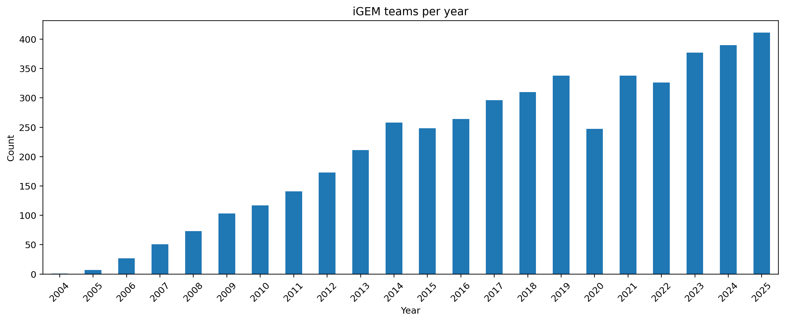
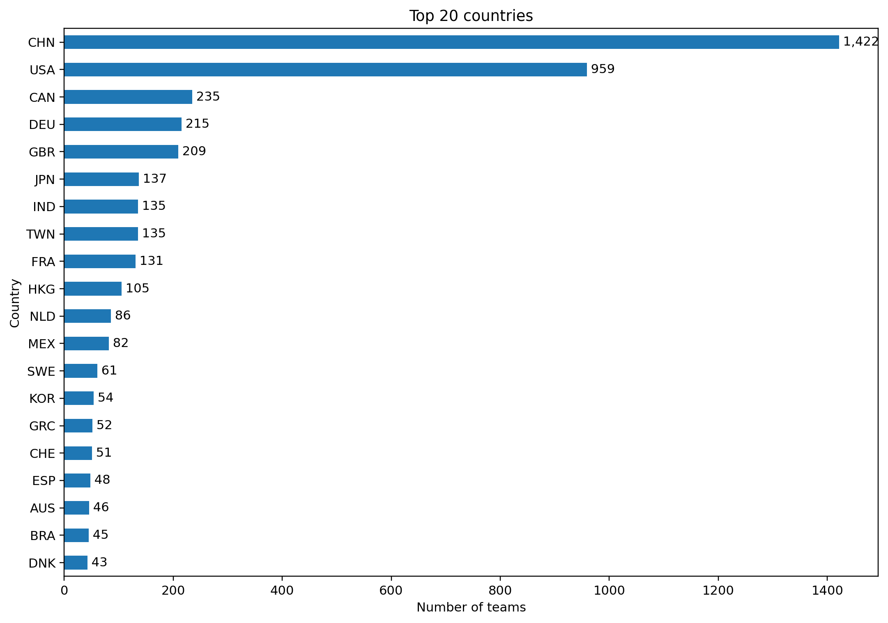
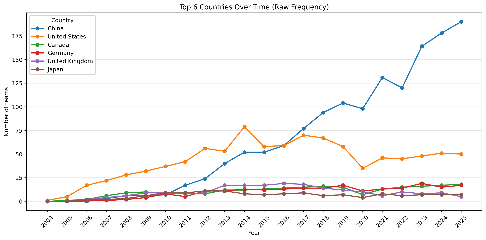
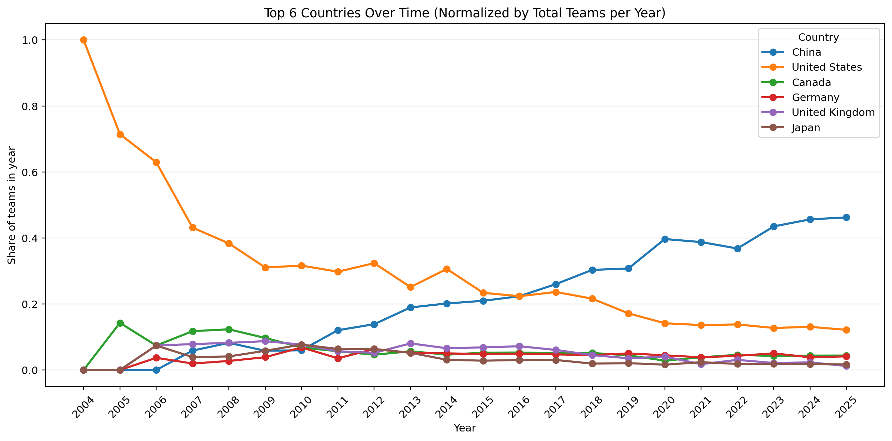
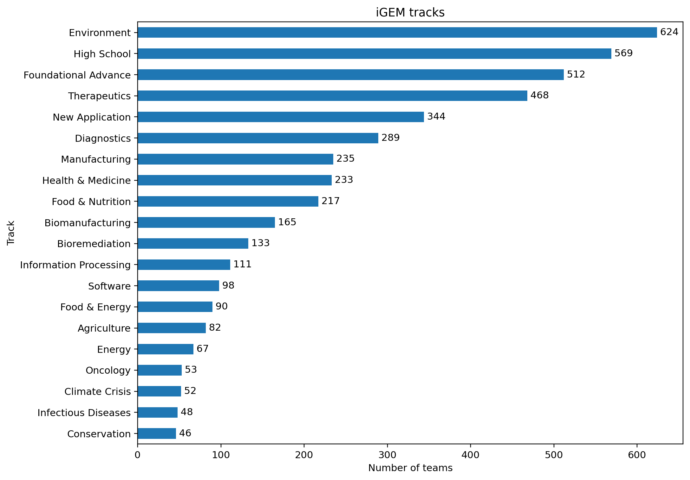

# iGEM Teams Dataset Stats Report

## Data Provenance
Original data from the iGEM competition provided by Marc Santolini (ISERM, Learning Planet Institute). Teams data from 2009 onwards sourced from teams project wikis public URLs trough an automated Python script. Teams project data from 2004 - 2008 manually sourced from archived project wikis also publicly available.  
This dataset combines iGEM team metadata and team project descriptions sourced from curated TSV exports used in this project (`team_meta_full.tsv` and `team_project_descriptions_manual_entries_v2.tsv`). The workflow keeps accepted teams and then retains records with non-empty project abstracts.

- Year range available: **2004–2025**
- Date of retrieval/report generation: **2026-05-19**
- Records (Teams) listed in files: **5096**
- Records accepted (Teams with status 'Accepted'): **4883**
- Records with non-empty project abstracts: **4,707**
- Total records used in this report: **4,707**

## Yearly Trends

Team participation changes substantially over time, with visible growth periods and fluctuations year to year.

## Country Stats

The country distribution is concentrated in a small set of leading contributors.

## Country Yearly Trends (Raw Frequency)

This chart shows annual team counts for the six leading countries using the same color palette used in the papers report.

## Country Yearly Trends (Normalized)

Normalization divides each country count by the total teams in that year, highlighting relative share dynamics independent of yearly cohort size.

## Others (Tracks)

Top tracks summarize the thematic distribution of iGEM projects in this filtered corpus.
