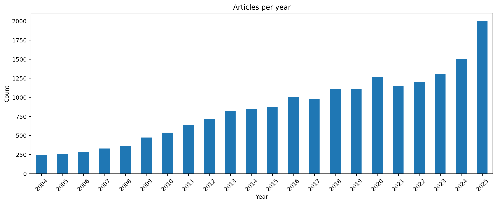
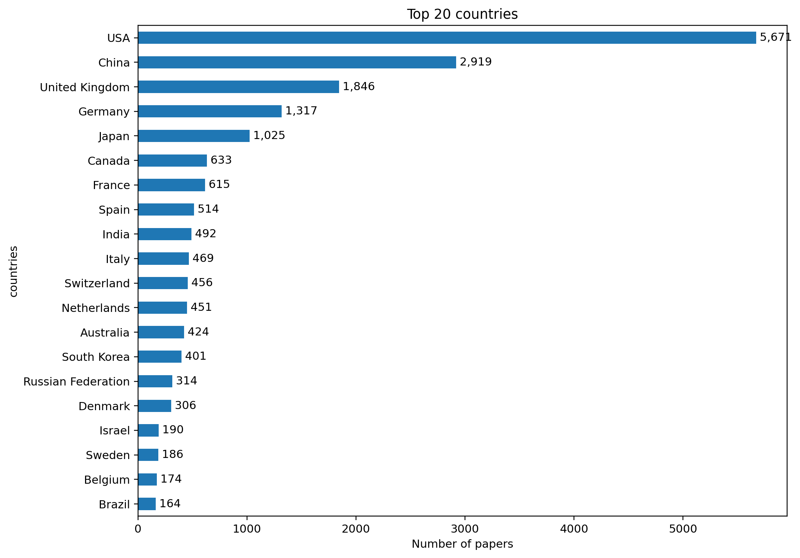
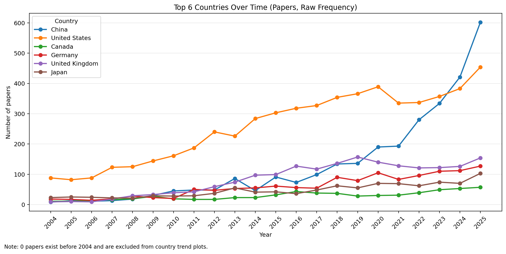
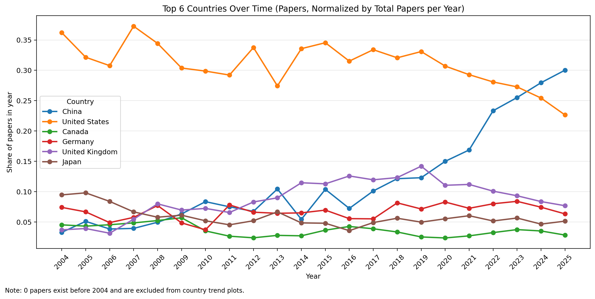
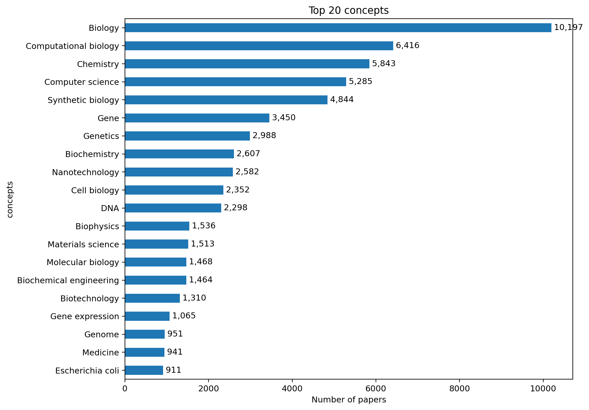

# OpenAlex SynBio Dataset Stats Report

## Data Provenance
This dataset is built by merging all local OpenAlex part exports (`synbio_openalex_PART_*.txt`) generated by the project retrieval notebook, then deduplicating by work ID, filtering to English publications, and removing records without abstracts.

- Year range available: **2004–2025**
- Date of retrieval/report generation: **2026-06-11**
- Total records used in this report: **19,017**
- Records available before 2004: **0**

## Yearly Trends

Publication volume increases substantially over time, indicating sustained expansion of the synthetic biology literature.

## Country Stats

Country contribution is concentrated in a core set of high-output countries.

Top 10 countries by paper count:

| Country        |   Papers |
|:---------------|---------:|
| USA            |     5671 |
| China          |     2919 |
| United Kingdom |     1846 |
| Germany        |     1317 |
| Japan          |     1025 |
| Canada         |      633 |
| France         |      615 |
| Spain          |      514 |
| India          |      492 |
| Italy          |      469 |

## Country Yearly Trends (Raw Frequency)

The trend starts in 2004 for comparability with iGEM, while the note in the figure reports how many papers exist before 2004.

## Country Yearly Trends (Normalized)

Normalization divides each country count by the total papers in that year to show relative contribution shares over time.

## Others (Concepts)

Top concepts summarize major themes represented in the OpenAlex corpus.

Top 10 concepts by paper count:

| Concept               |   Papers |
|:----------------------|---------:|
| Biology               |    10197 |
| Computational biology |     6416 |
| Chemistry             |     5843 |
| Computer science      |     5285 |
| Synthetic biology     |     4844 |
| Gene                  |     3450 |
| Genetics              |     2988 |
| Biochemistry          |     2607 |
| Nanotechnology        |     2582 |
| Cell biology          |     2352 |
